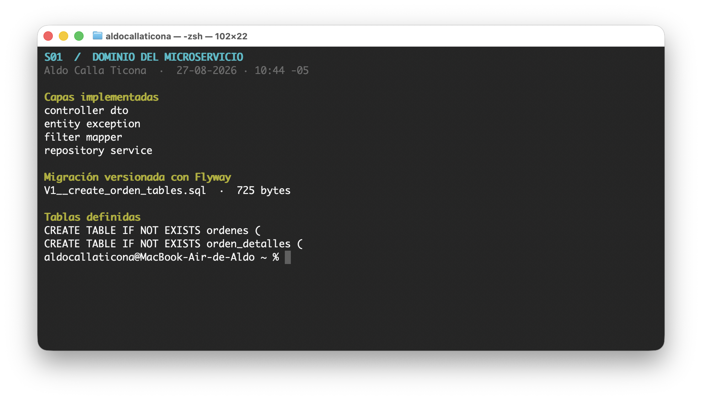
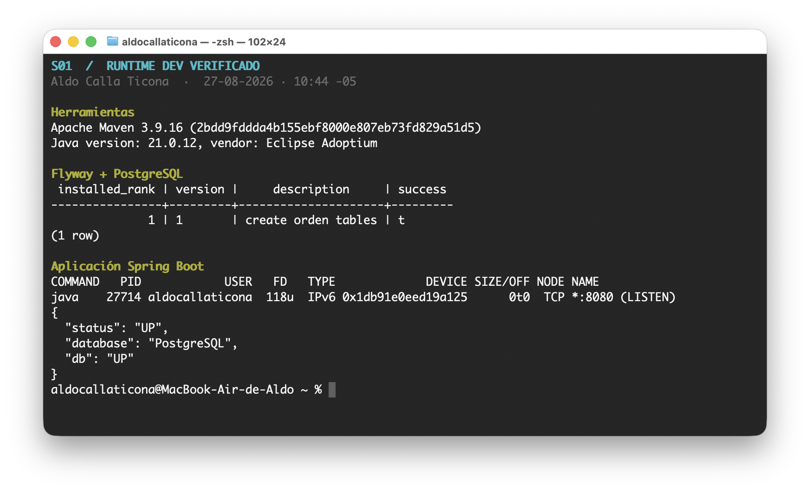
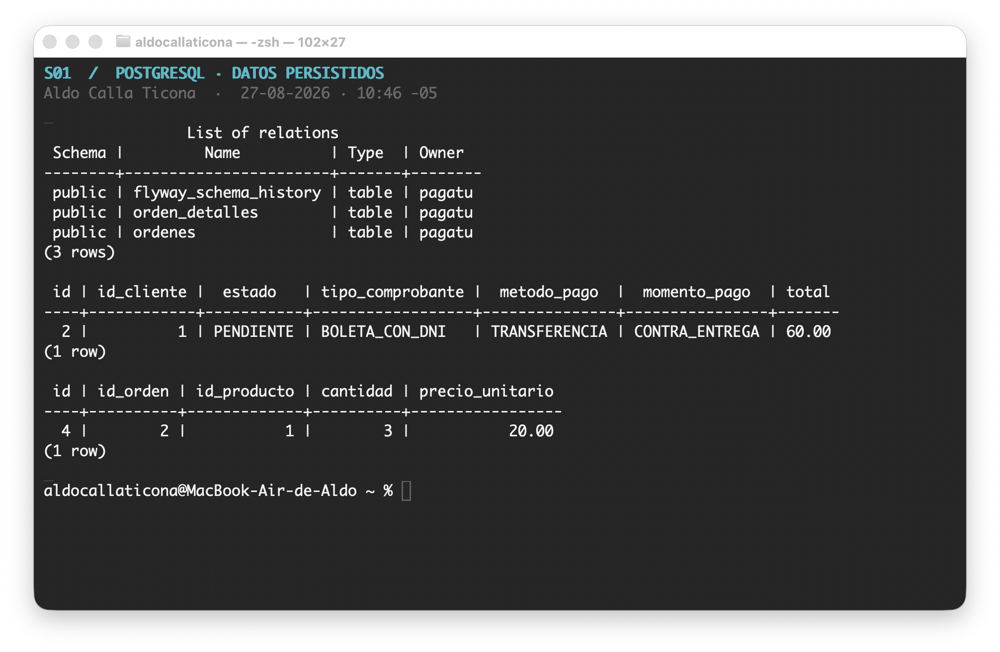
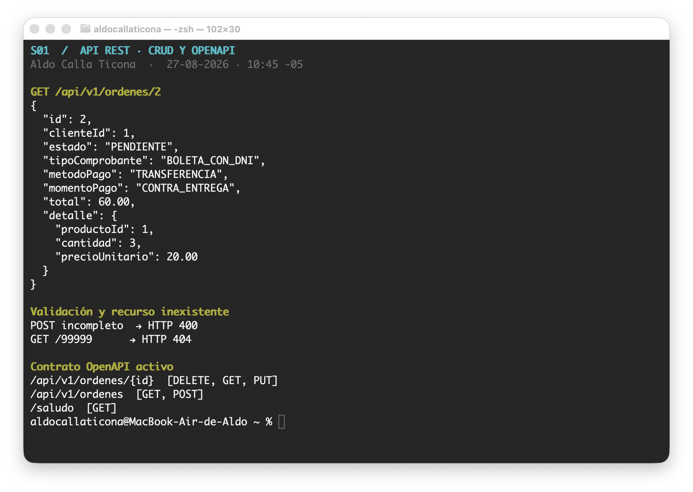
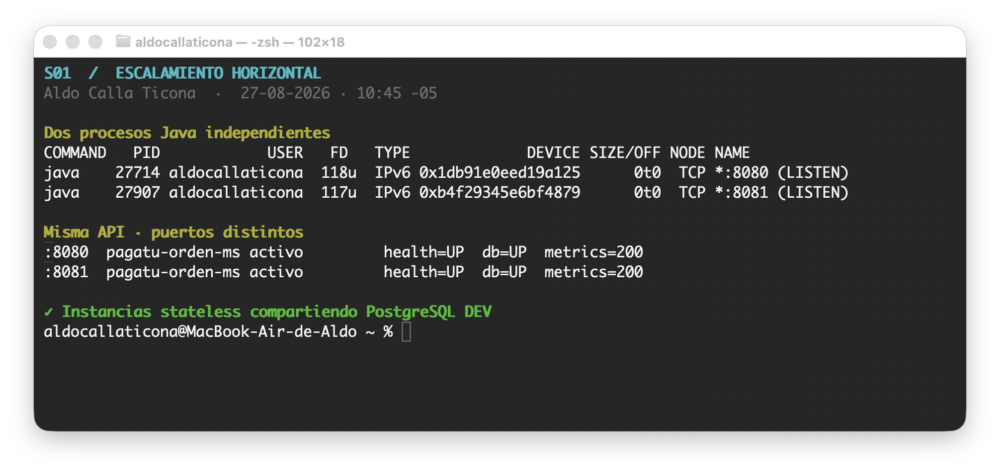

# S01 - Construcción de un servicio base para un sistema distribuido

## Datos del estudiante

- **Nombre:** Aldo Calla Ticona
- **Equipo:** Sin grupo
- **Sesión:** S01 - Construcción de un servicio base para un sistema distribuido
- **Rol o aporte realizado:** Implementación individual de `pagatu-orden-ms` y verificación del patrón desarrollado en S01.
- **Link de GitHub:** <https://github.com/Aldo-Ct/Pagalotu>

## 1. Microservicios correctamente delimitados según el dominio

`pagatu-orden-ms` gestiona exclusivamente las órdenes y sus detalles: cliente asociado, fecha, estado, comprobante, método y momento de pago, total, productos, cantidades y precios registrados. No administra categorías, productos ni clientes; conserva únicamente sus identificadores porque esos datos pertenecen a `pagatu-catalogo-ms` y `pagatu-cliente-ms`.

La implementación se divide en `controller`, `service`, `repository`, `entity`, `dto`, `mapper`, `exception` y `filter`, evitando mezclar responsabilidades de otros dominios.



*Evidencia 1. Estructura por capas de `pagatu-orden-ms` y migración versionada `V1__create_orden_tables.sql`. La ventana muestra el usuario y la fecha/hora del sistema.*

## 2. Persistencia de datos con PostgreSQL y Flyway

El ambiente DEV usa PostgreSQL 16 en Docker, en el puerto `15434`. El servicio se ejecutó con Java 21 y Maven Wrapper; Flyway validó la migración V1 antes de que Tomcat iniciara en el puerto 8080.



*Evidencia 2. Maven Wrapper 3.9.16, Java 21, migración Flyway aplicada, proceso en 8080 y estado Health/DB UP.*

La consulta con `psql` confirma las tablas `ordenes`, `orden_detalles` y `flyway_schema_history`. También demuestra que el registro actualizado quedó persistido con total `60.00` y que su detalle contiene tres unidades a `20.00`.



*Evidencia 3. Tablas creadas por Flyway y registros persistidos en PostgreSQL. La evidencia incluye usuario y fecha/hora.*

## 3. Endpoints REST funcionales y documentados

El recurso principal utiliza `/api/v1/ordenes` y ofrece CRUD completo. Las pruebas se realizaron por shell, sin Postman.

| Operación | Endpoint | Resultado |
| --- | --- | --- |
| Crear | `POST /api/v1/ordenes` | HTTP 201 |
| Listar | `GET /api/v1/ordenes` | HTTP 200 |
| Obtener | `GET /api/v1/ordenes/2` | HTTP 200 |
| Actualizar | `PUT /api/v1/ordenes/2` | HTTP 200 |
| Eliminar | `DELETE /api/v1/ordenes/{id}` | HTTP 204 |
| Validación | `POST /api/v1/ordenes` con datos incompletos | HTTP 400 |
| Inexistente | `GET /api/v1/ordenes/99999` | HTTP 404 |

Swagger UI y el contrato OpenAPI respondieron HTTP 200 en `/swagger-ui/index.html` y `/v3/api-docs`.



*Evidencia 4. Lectura del registro actualizado, validación HTTP 400, recurso inexistente HTTP 404 y disponibilidad de Swagger/OpenAPI.*

## 4. Ejecución y escalamiento horizontal

Se ejecutaron simultáneamente dos instancias de `pagatu-orden-ms`: la primera en `8080` y la segunda en `8081`, usando `--server.port=8081`. Ambas se conectaron de forma independiente a la misma PostgreSQL DEV y respondieron HTTP 200 en `/saludo` y `/actuator/health`.



*Evidencia 5. Procesos Java independientes escuchando en 8080 y 8081; ambas instancias responden y Actuator Metrics está disponible.*

Un microservicio debe ser stateless para que cualquier instancia pueda atender una petición sin depender de memoria local previa. El puerto se configura externamente para evitar choques y permitir que un futuro Gateway o balanceador distribuya tráfico entre copias equivalentes.

| Aspecto | Instancia 1 | Instancia 2 |
| --- | --- | --- |
| Puerto | 8080 | 8081 mediante argumento |
| Base de datos | PostgreSQL DEV compartida | PostgreSQL DEV compartida |
| `/saludo` | HTTP 200 | HTTP 200 |
| `/actuator/health` | HTTP 200, DB UP | HTTP 200, DB UP |

## 5. Documentación técnica clara y reproducible

El archivo `README.md` documenta requisitos, inicio con Maven Wrapper, Docker Compose, Swagger, Actuator, pruebas CRUD, consultas `psql` y ejecución de la segunda instancia.

Requisitos:

- Java 21.
- Docker Desktop.
- Maven Wrapper incluido en el microservicio.

Ejecución reproducible en DEV:

```bash
cd Services/pagatu-orden-ms
docker compose -f compose-dev.yml up -d
./mvnw spring-boot:run
```

Segunda instancia:

```bash
./mvnw spring-boot:run -Dspring-boot.run.arguments=--server.port=8081
```

Verificación:

```bash
curl http://localhost:8080/actuator/health
curl http://localhost:8081/actuator/health
curl http://localhost:8080/api/v1/ordenes
```

La ejecución PROD local con Docker no se incluyó porque la guía la identifica como opcional y no es necesaria para alcanzar el nivel A.

## Error o hallazgo técnico

Durante el primer arranque apareció `Unable to obtain connection from database`. La causa estaba en que PostgreSQL todavía no estaba disponible en `localhost:15434`. Se revisó el mensaje de Flyway, se inició `pagatu-postgres-orden-dev` con Docker Compose y se verificó la conexión. Después, Flyway aplicó la migración V1 y la aplicación inició correctamente.

Al levantar la segunda instancia, LiveReload informó que su puerto auxiliar ya estaba ocupado. El aviso no detuvo Tomcat ni afectó los endpoints. Esto permitió diferenciar el puerto auxiliar de desarrollo del puerto HTTP principal y confirmar que las instancias 8080/8081 funcionaban en paralelo.

## Reflexión técnica breve

- Un microservicio debe ejecutarse de forma reproducible para evitar configuraciones manuales ocultas.
- Maven Wrapper fija la herramienta de construcción utilizada en DEV.
- Docker Compose proporciona una PostgreSQL consistente para cualquier integrante.
- El servicio debe ser stateless para que varias instancias atiendan solicitudes equivalentes.
- El puerto no debe estar acoplado al código porque cada instancia necesita uno disponible.
- Más adelante, un Gateway o balanceador podrá repartir el tráfico entre las instancias.

<!-- PAGEBREAK -->

## Anexo: Feedback de la sesión

### 1. ¿Cuál es el aprendizaje más importante que te llevas de la clase de hoy?

Que los microservicios son importantes para dividir el trabajo y evitar que todo el sistema dependa de un único componente. Si un servicio falla, los demás pueden continuar funcionando con normalidad.

### 2. ¿Qué punto de la clase te resultó más confuso o te dejó con dudas?

La instalación de dependencias y la creación del proyecto en VS Code y Spring Initializr, porque anteriormente trabajé en IntelliJ y ese proceso se me hacía más sencillo.

### 3. ¿Tienes alguna pregunta que te gustaría que sea respondida la siguiente clase?

¿Cuál es la forma recomendada de instalar y gestionar dependencias de Spring Boot desde VS Code para evitar errores de compatibilidad?

### 4. Nivel de comprensión

**Más o menos.** Entendí la idea general, pero todavía tengo dudas.

### 5. ¿Cómo puedo ayudarte a comprender mejor el tema?

Me ayudaría repasar paso a paso la creación del proyecto y la selección o instalación de dependencias en VS Code.

### 6. Autoevaluación de participación y esfuerzo

**Comprometido.** Sé que podría haberme esforzado un poco más.

### 7. Satisfacción con la clase

**7 de 10.**
